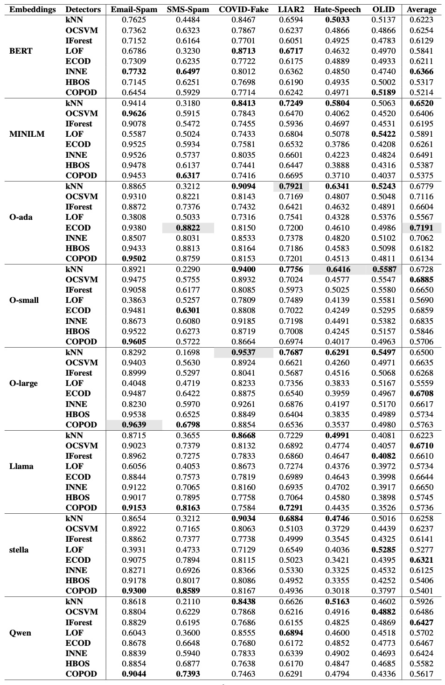
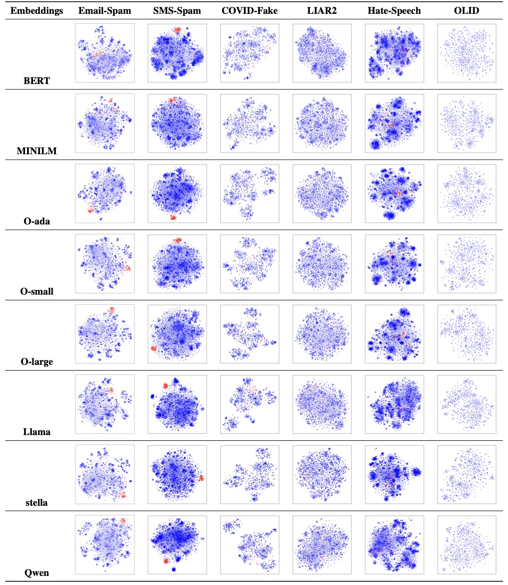

# TAD-Bench

## Overview

TAD-Bench is a novel benchmark specifically designed for text anomaly detection. Our objective is to enable a more comprehensive and systematic evaluation of state-of- the-art embeddings, anomaly detection techniques, and their various combinations, offering valuable insights for a broad spectrum of NLP applications.
By incorporating a diverse range of embedding models and rigorously evaluating an extensive suite of anomaly detection methods, TAD-Bench facilitates an in-depth understanding of their effectiveness on static datasets, with a strong emphasis on robustness, adaptability, and real-world applicability. 

## Dataset

The data can be found at [Datasets](https://github.com/charles-cao/TAD-Bench/blob/main/data.zip).

## Code

All the file name with model_name_embeddings are the pre-trained models with different embedding methods.

## Performance Comparison

## Embedding Demonstration

